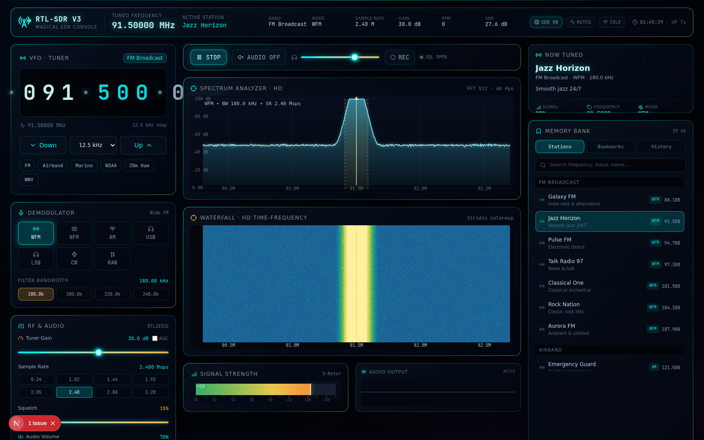

# RTL-SDR V3 — Magical SDR Console

A high-definition web console for the RTL-SDR V3 software-defined radio. Built with Next.js 16, TypeScript, Tailwind CSS 4, and Zustand. Includes both a built-in **simulated SDR engine** (works in any browser, no hardware) and **real hardware support** via a small WebSocket bridge that wraps `rtl_tcp`.



## Features

### Visual core
- **HD Spectrum Analyzer** — DPR-aware canvas, 60 fps, glowing cyan trace, peak-hold line, axis labels in dBFS / Hz, click-to-tune
- **HD Waterfall Display** — Viridis colormap, time-frequency scrolling spectrogram, click-to-tune
- **Frequency Tuner** — Per-digit click-to-increment VFO (right-click decrements), 8 step sizes, quick band presets
- **Status Header** — Live clock, uptime, band, mode, gain, SNR, hardware status badges
- **S-Meter** — Real-time signal strength with S0–S9+60 dB scale and squelch threshold marker
- **Audio Oscilloscope** — Real-time frequency-domain visualization of demodulated audio

### Demodulators (real + simulated)
- **WFM** — broadcast FM with 75 µs de-emphasis
- **NFM** — narrow FM for VHF/UHF voice
- **AM** — airband, shortwave broadcast (with DC tracker)
- **USB / LSB** — HF single-sideband (phasing method with BFO)
- **CW** — Morse code with 700 Hz BFO
- **RAW** — unfiltered magnitude output

### Real hardware support
- **WebSocket bridge** to `rtl_tcp` — talk to your physical RTL-SDR V3 from any browser
- **TLS support** — `--tls` flag auto-generates a self-signed cert for portable access
- **HTTP server** for serving recorded IQ files
- **Preset sync** — save/load bookmarks across devices via the bridge
- See [`download/sdr-bridge/README.md`](download/sdr-bridge/README.md) for full setup instructions

### Decoders (run automatically when tuned to the right band)
- **RDS** (Radio Data System) — decodes PI code, PS station name, PTY, Radio Text, M/S flag, TA flag, group type on broadcast FM (87.5–108 MHz WFM)
- **ADS-B** (Mode S Extended Squitter) — decodes aircraft transponders at 1090 MHz, including:
  - ICAO 24-bit address
  - Callsign (8 chars)
  - Altitude (Q-bit compressed)
  - Ground speed + track (CPR position decoding)
  - Vertical rate
  - **Live radar-style polar plot** with range rings (50/100/150/200 nm) and sweep animation
- **APT** (Automatic Picture Transmission) — decodes NOAA weather satellite images at 137–138 MHz (NOAA-15/18/19). Live image grows as it's decoded.
- **POCSAG** — decodes pager messages (512/1200/2400 bps) on 929–932 MHz and 138–174 MHz
- **ACARS** — decodes aircraft messaging at 131.55 MHz

### Pro tools
- **IQ Recording** — record raw IQ to disk on the bridge side (32 KB chunks, MB/s rate display), downloadable via HTTP
- **Audio WAV Recording** — capture demodulated audio as 16-bit PCM WAV in-browser
- **Scanner** — three modes:
  - Peak scan — auto-tune to the strongest signal in view
  - Sweep — map every signal in a band (FM, Airband, Marine, NOAA, 2m/70cm Ham, GMRS, HF, CB)
  - Squelch — step through a band, stop on each signal above threshold
- **Notch Filter** — auto-detect + suppress strong interferers (biquad IIR, up to 16 notches), or add manual notches
- **Memory Bank** — searchable station list (29 real-world frequencies), bookmarks, history
- **Fullscreen Spectrum Mode** — giant spectrum + waterfall view (ESC to exit)
- **Keyboard Shortcuts** — `?` to show help, Space=mute, ↑↓=tune, ←→=demod, A=AGC, R=record, S=scan, F=fullscreen

## Tech stack

- **Framework**: Next.js 16 (App Router) + TypeScript 5
- **Styling**: Tailwind CSS 4 + shadcn/ui
- **State**: Zustand (client), TanStack Query (server, unused by default)
- **Audio**: Web Audio API with both synth (simulated) and real demodulated PCM
- **DSP**: Custom in-browser FFT (radix-2 Cooley-Tukey), biquad filters, demodulators

## Architecture

```
                         Browser (Next.js app)
                              │
            ┌─────────────────┼─────────────────────┐
            │                 │                     │
       Simulated         Real SDR              UI panels
       SDR engine        source (WS)           (spectrum, tuner,
       (no HW needed)     ↓                     decoders, scanner,
                   WebSocket bridge            notch, etc.)
                              │
                              ↓
                         rtl_tcp (TCP)
                              │
                              ↓
                         RTL-SDR V3 USB dongle
```

The browser can't talk to USB SDR hardware directly at the rates the RTL2832U needs (2.4+ MS/s of bulk transfers). The bridge wraps `rtl_tcp` and exposes IQ data + control over WebSocket. See `download/sdr-bridge/README.md` for the full protocol spec.

### Source layout
```
src/
├── app/
│   ├── globals.css        Custom dark theme, glassmorphic panels, magical glow effects
│   ├── layout.tsx         Root layout with RTL-SDR metadata
│   └── page.tsx           Main 3-column dashboard layout
├── components/
│   ├── ui/                shadcn/ui component library
│   └── sdr/               RTL-SDR-specific components
│       ├── active-station-card.tsx
│       ├── adsb-panel.tsx         ADS-B tracker + radar plot
│       ├── apt-panel.tsx          APT weather satellite image
│       ├── audio-oscilloscope.tsx
│       ├── audio-recorder.tsx     WAV recording (browser-side)
│       ├── bookmarks-panel.tsx    Station list + bookmarks + sync
│       ├── connection-panel.tsx   Real vs Simulated toggle
│       ├── demodulator-controls.tsx
│       ├── frequency-tuner.tsx
│       ├── fullscreen-spectrum.tsx
│       ├── gain-controls.tsx
│       ├── keyboard-shortcuts.tsx
│       ├── messages-panel.tsx     POCSAG + ACARS messages
│       ├── notch-filter-panel.tsx
│       ├── recording-panel.tsx    Server-side IQ recording
│       ├── rds-overlay.tsx        RDS floating card
│       ├── scanner-panel.tsx      Peak/Sweep/Squelch scanner
│       ├── signal-meter.tsx       S-meter
│       ├── spectrum-analyzer.tsx  HD canvas spectrum
│       ├── status-header.tsx
│       ├── transport-bar.tsx      Play/Stop, Audio, Volume, REC
│       └── waterfall-display.tsx  HD canvas waterfall
├── lib/
│   ├── sdr-engine.ts      Simulated SDR engine (stations, FFT, spectrum)
│   ├── sdr-store.ts       Zustand store (frequency, demod, gain, etc.)
│   ├── sdr-audio.ts       Web Audio synth + real audio frame pusher
│   └── real-sdr/
│       ├── types.ts       Shared protocol types (commands, status, IQ blocks)
│       ├── dsp.ts         FFT, biquads, decimation
│       ├── demodulators.ts FM/AM/SSB/CW demodulators
│       ├── rds.ts          RDS decoder (PI/PS/PTY/RT)
│       ├── adsb.ts         ADS-B Mode S decoder with CPR position
│       ├── apt.ts          NOAA APT image decoder
│       ├── pocsag.ts       POCSAG pager decoder
│       ├── acars.ts        ACARS message decoder
│       ├── notch-filter.ts IIR biquad notch filter
│       ├── real-sdr-source.ts  WebSocket client + dispatcher
│       └── use-real-sdr.ts     React hook for source lifecycle

download/sdr-bridge/      Standalone Node.js bridge script (rtl_tcp → WebSocket)
public/download/sdr-bridge/  Same files served by the app for in-app download
```

## Quick start

### Run the app
```bash
bun install        # or npm install
bun run dev        # or npm run dev
# → http://localhost:3000
```

The app starts in **simulated mode** — fully functional, no hardware needed. You'll see fake stations across the FM, Airband, Marine, NOAA, Ham, and Shortwave bands, with synthesized audio that matches each station's type (music, voice, morse, etc.).

### Connect a real RTL-SDR V3
1. Install `rtl_tcp` (`brew install librtlsdr` on macOS, `apt install rtl-sdr` on Linux, prebuilt binaries on Windows)
2. Plug in your RTL-SDR V3 and run `rtl_tcp -s 2400000`
3. Download `bridge.mjs` and `package.json` from the Connection Panel in the app (or from `download/sdr-bridge/` in this repo)
4. In the bridge folder: `npm install && npm start`
5. In the web app, click **Real RTL-SDR** in the Hardware Source panel (top-left)
6. Status should flip to **LIVE HW** within a second
7. Click **AUDIO ON** to hear the demodulated signal

For portable access (use the dongle from your phone or another device), start the bridge with `--tls`:
```bash
node bridge.mjs --tls   # → wss://0.0.0.0:8443
```

See [`download/sdr-bridge/README.md`](download/sdr-bridge/README.md) for full setup, troubleshooting, and protocol docs.

## What to try

- **Listen to FM broadcast** — tune to a local FM station (87.5–108 MHz, WFM mode), enable AUDIO, see RDS station name appear in the spectrum panel
- **Track aircraft** — tune to 1090 MHz (RAW mode), watch planes appear on the radar plot with callsigns, altitudes, and positions
- **Decode NOAA weather satellites** — tune to 137.5 MHz (NOAA-19) during a pass, see live Earth images grow line-by-line. Check [N2YO.com](https://www.n2yo.com/) for pass times
- **Decode pagers** — tune to 929–932 MHz, watch hospital/fire/IT pager messages appear in real time
- **Decode aircraft messaging** — tune to 131.55 MHz, see ACARS text messages between planes and dispatchers
- **Scan a band** — click "FIND STRONGEST SIGNAL" or pick a band preset (FM, Airband, Marine, etc.) and SWEEP to map every signal
- **Record IQ** — capture raw RF to disk, download as `.raw`, replay in SDR# or GQRX
- **Filter interference** — toggle "Auto-detect interferers" to suppress strong local stations swamping your dongle
- **Sync bookmarks across devices** — use the cloud icons in the Memory Bank header to push/pull your bookmarks to the bridge

## Keyboard shortcuts

Press `?` in the app to see all shortcuts. Highlights:

| Key | Action |
|---|---|
| `Space` / `M` | Toggle audio mute |
| `↑` / `↓` | Tune up/down (25 kHz) |
| `←` / `→` | Switch demodulator mode |
| `[` / `]` | Sample rate down / up |
| `-` / `+` | Gain down / up |
| `A` | Toggle AGC |
| `R` | Toggle IQ recording |
| `S` | Toggle scan mode |
| `F` | Toggle fullscreen spectrum |
| `Esc` | Close dialog / exit fullscreen |

## Browser notes

Browsers block `ws://` (insecure WebSocket) connections from `https://` pages — **except** for `ws://localhost` and `ws://127.0.0.1`. So:
- ✅ Bridge on the same PC as the browser → `ws://localhost:8080` works
- ✅ Run the app locally on `http://localhost:3000` → any bridge URL works
- ✅ Bridge with `--tls` → `wss://...` works from any HTTPS page
- ✅ Use `ngrok http 8080` → `wss://...ngrok.io` works from anywhere

## License

MIT — see [`LICENSE`](LICENSE) (or feel free to drop your own).

## Acknowledgments

- [osmocom rtl-sdr](https://osmocom.org/projects/rtl-sdr/wiki) — the open-source RTL-SDR driver and `rtl_tcp` daemon
- [shadcn/ui](https://ui.shadcn.com/) — component library
- [Tailwind CSS](https://tailwindcss.com/) — styling
- ICAO Annex 10, RTCA DO-260, ETSI ETS 300 133, ARINC 618, IEC 62106 — protocol references
